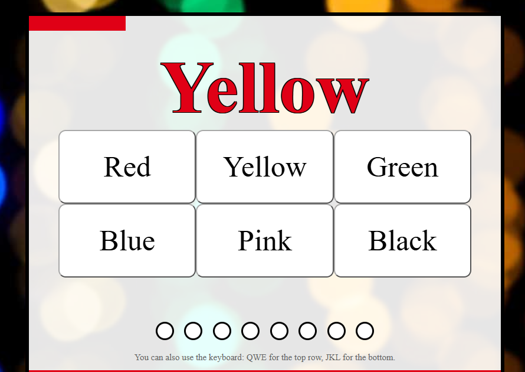

# Click the color not the word
## Technologies Used
1. HTML
2. CSS
3. JavaScript

## Descripton 
This is a simple game where a word is displayed multiple times. Each time the word appears in a randomly selected text color. The player goal is to click the button that matches the color of the text, not the word itself.
## User Stories
1. As a User, I want to see the word with it's color very clear
2. As a User, I want to click on the color button to take my answer
3. As a User, I want to see if I choose all the colors correct that my focus is strong
4. As a User, I want the game ends when I miss one I have 3 chances to continue with the game
4. As a User, I want to see a restart button and when I click it the game should reset

## ScreenShots

## 