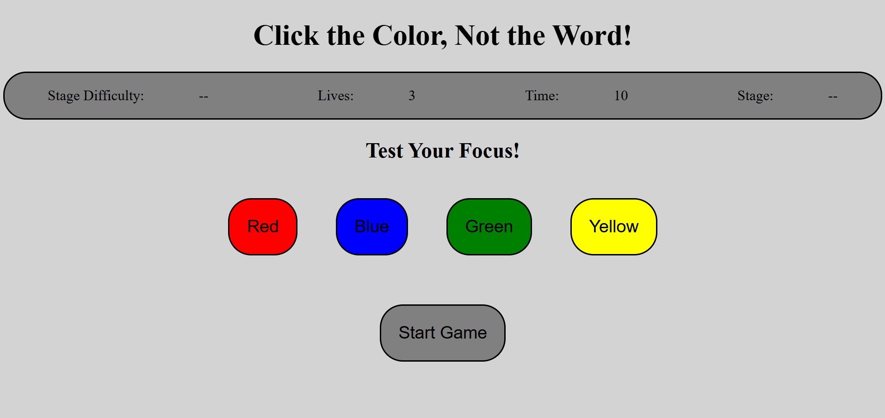
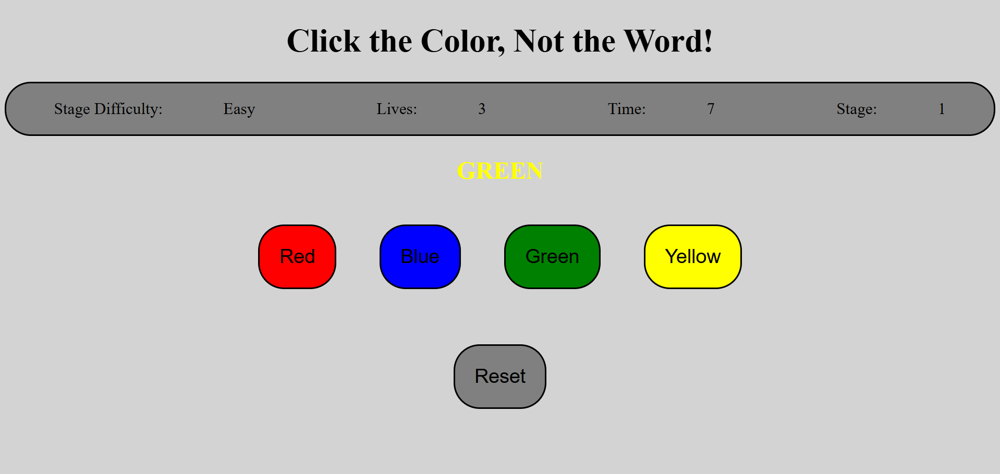
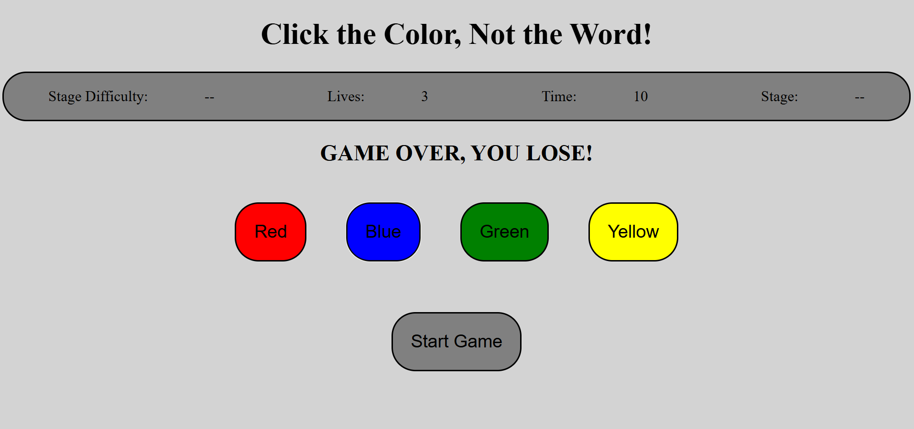

# Click the color not the word
## Technologies Used
1. HTML
2. CSS
3. JavaScript

## Descripton 
This is a simple game where a word is displayed multiple times. Each time the word appears in a randomly selected text color. The player goal is to click the button that matches the color of the text, not the word itself.
## User Stories
1. As a User, I want to see the word with it's color very clear
2. As a User, I want to click on the color button to take my answer
3. As a User, I want to see if I choose all the colors correct I win
4. As a User, I want the game ends when I miss one I have 3 chances to continue with the game
5. As a User, I want to see a timer to know how much time I have in each stage
6. As a User, I want to see stage counter to see wich stage am currently in
7. As a User, I want to see the stage difficulty of each stage
8. As a User, I want to see a restart button and when I click it the game should reset

## ScreenShots

## future improvement
1. Add HardCore mode that is more much difficult
2. Add reversed logic game clicking the word not the color 
3. Add pictures game of the same logic and player should match the random generated picture
4. Add more colors and color words
## credits
* https://developer.mozilla.org/en-US/docs/Web/API/Window/setInterval
* https://www.w3schools.com/
* https://s3.mirror.co.uk/click-the-colour-and-not-the-word/index.html